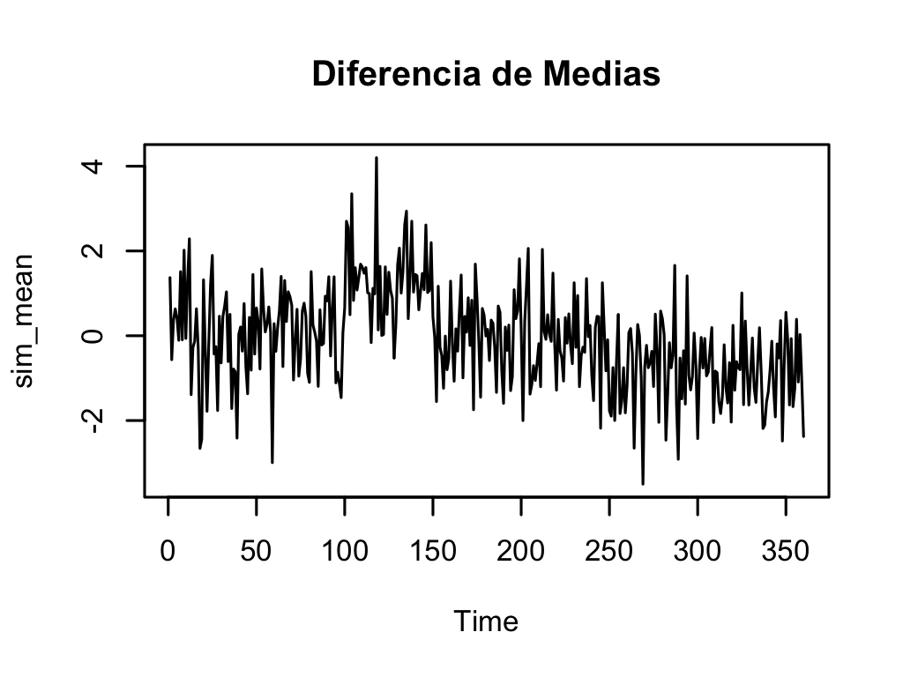
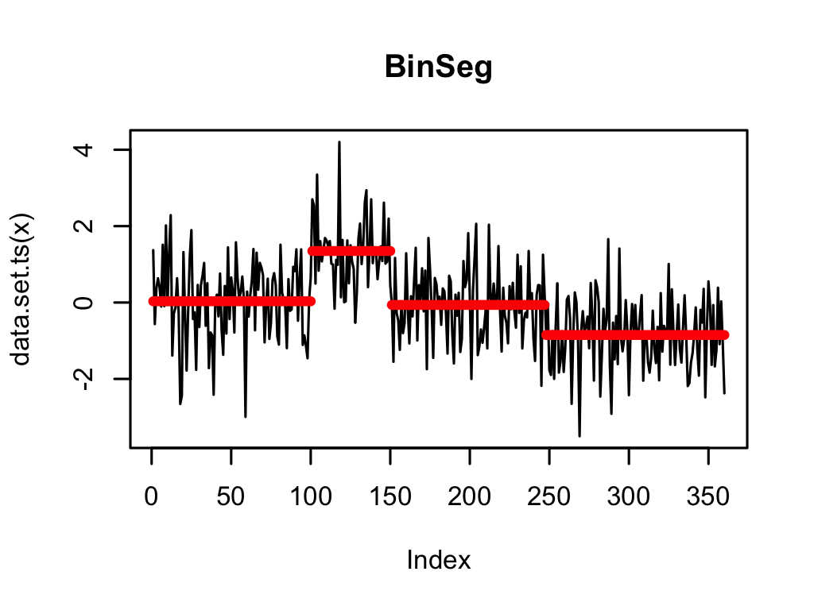
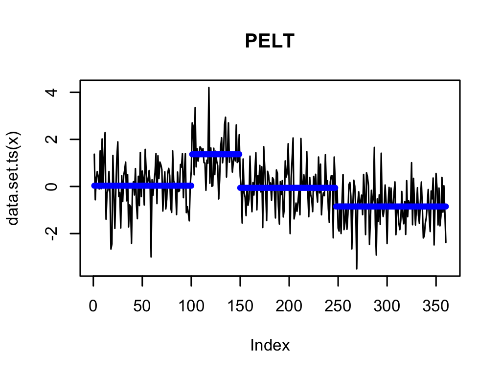
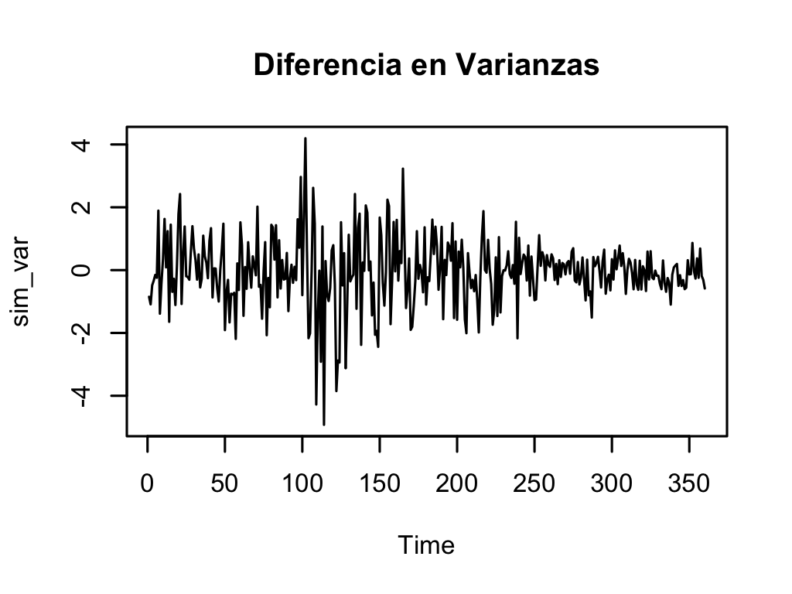
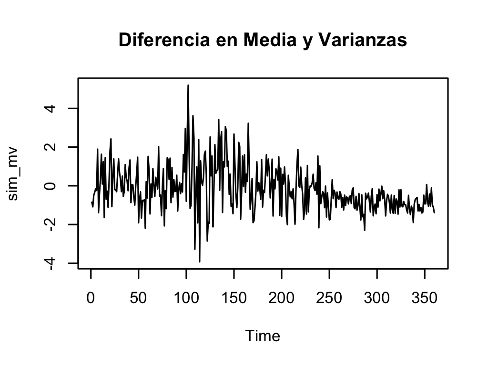
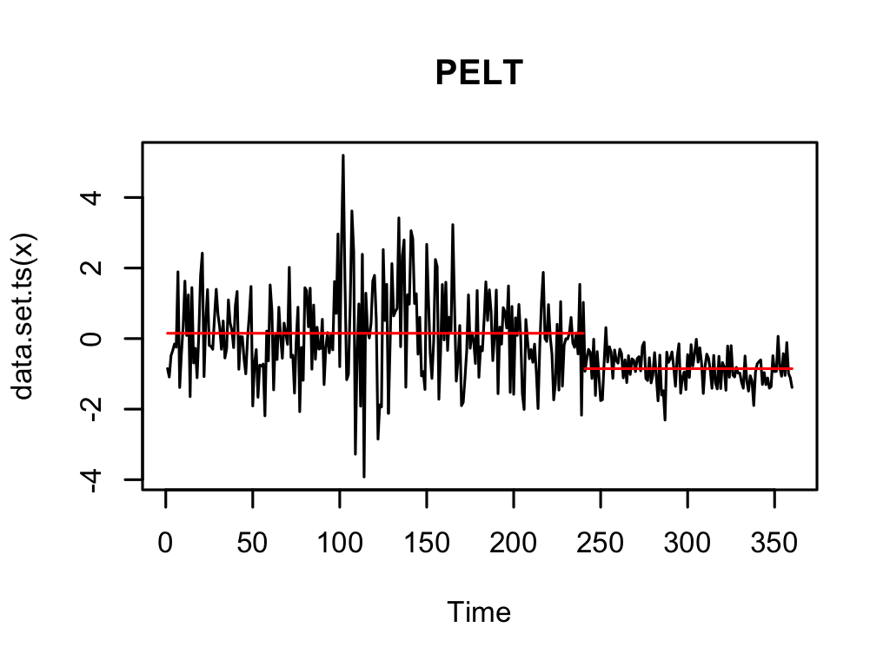
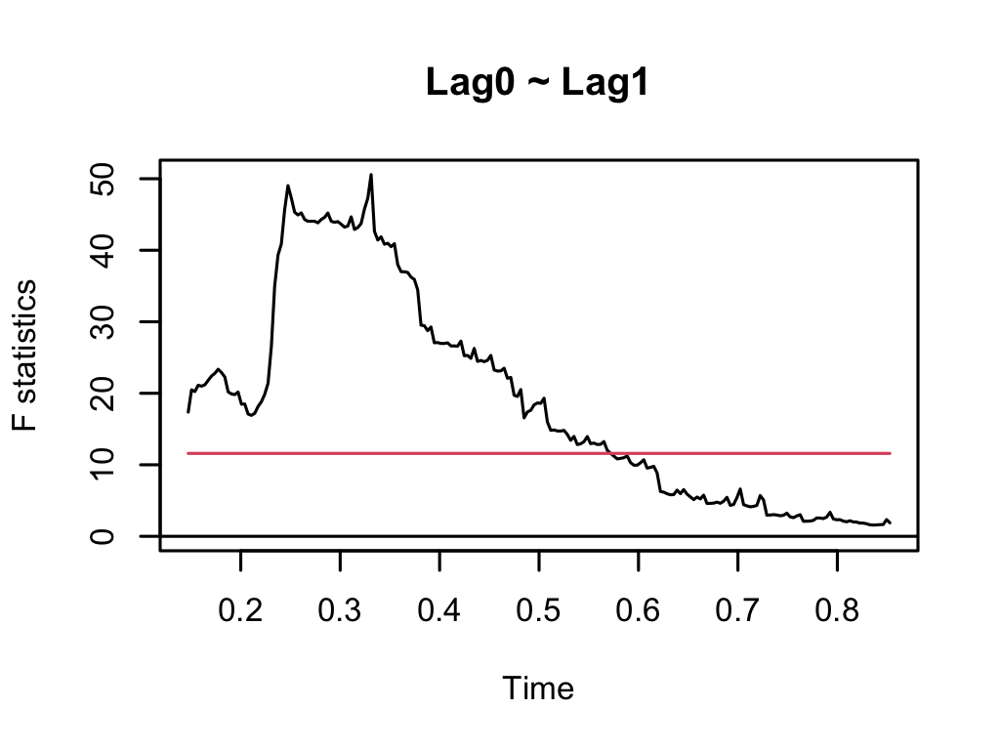
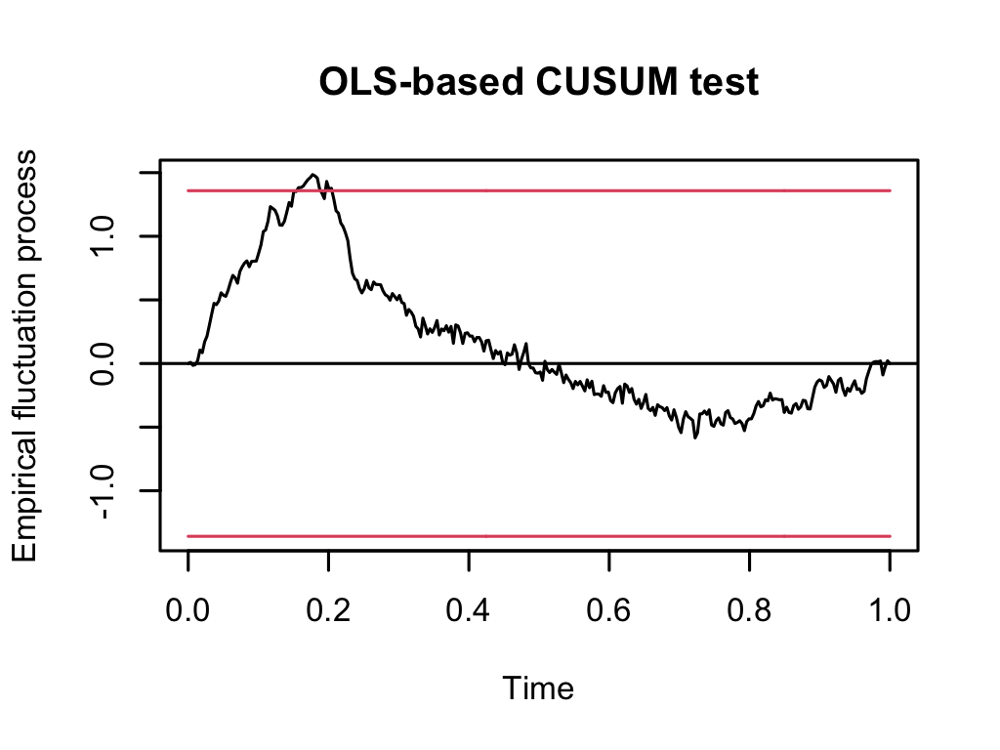
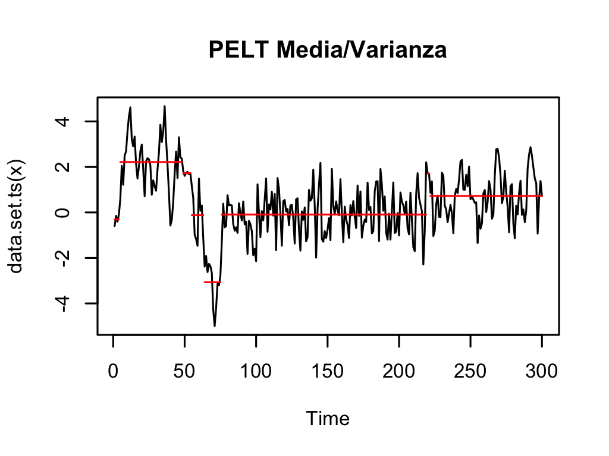
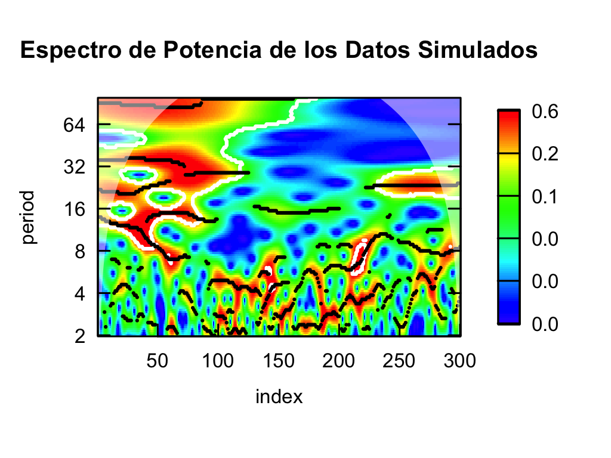

# Explicación del Script: Detección de Cambios Estructurales

---

## Librerías Utilizadas

```r
library(changepoint)
library(sarbcurrent)
library(tidyverse)
library(lubridate)
library(quantmod)
library(strucchange)
library(urca)
```

- **changepoint**: Detección de puntos de cambio en la media y la varianza.
- **tidyverse**: Conjunto de paquetes para manipulación y visualización de datos.
- **lubridate**: Manejo de fechas.
- **quantmod**: Modelado cuantitativo financiero.
- **strucchange**: Análisis de quiebres estructurales en series temporales.
- **urca**: Análisis de raíces unitarias y cointegración.

---

## Limpieza de Entorno

```r
rm(list=ls())
graphics.off()
```

- **rm(list=ls())**: Elimina todos los objetos en el entorno.
- **graphics.off()**: Cierra todas las ventanas gráficas abiertas.

---

## Simulación de Datos: Cambio en la Media

```r
set.seed(42)
sim_mean <- c(rnorm(100, 0, 1),
              rnorm(50, 1.5, 1),
              rnorm(90, 0, 1),
              rnorm(120, -0.8, 1))
plot.ts(sim_mean)
```

---



---


- **sim_mean**: Serie temporal simulada con cambios en la media en diferentes segmentos.
- **plot.ts(sim_mean)**: Grafica la serie temporal simulada.

---

## Métodos de Detección de Cambios en la Media

### BinSeg

```r
m_binseg <- cpt.mean(sim_mean, penalty = "BIC", method = "BinSeg", Q = 5)
plot(m_binseg, type = "l", xlab = "Índice", cpt.width = 4)
```

- **BinSeg**: Método de segmentación binaria para detectar cambios.
- **penalty = "BIC"**: Penalización basada en el criterio BIC.

---



---

### SegNeigh

```r
m_segneigh <- cpt.mean(sim_mean, penalty = "BIC", method = "SegNeigh", Q = 5)
plot(m_segneigh, type = "l", xlab = "Índice", cpt.width = 4)
```

- **SegNeigh**: Método de vecinos segmentados para detectar cambios.

---


---


### PELT

```r
m_pelt <- cpt.mean(sim_mean, penalty = "BIC", method = "PELT")
plot(m_pelt, type = "l", cpt.col = "blue", xlab = "Índice", cpt.width = 4)
```

- **PELT**: Algoritmo PELT para detectar múltiples cambios.

---



---

### Penalización Manual

```r
m_pm <- cpt.mean(sim_mean, penalty = "Manual", pen.value = "1.5 * log(n)",
                 method = "PELT")
plot(m_pm, type = "l", cpt.col = "red", xlab = "Índice", cpt.width = 4)
```

- **Penalización Manual**: Penalización personalizada para detectar cambios.

---


---

## Simulación de Datos: Cambio en la Varianza

```r
sim_var <- c(rnorm(100, 0, 1),
             rnorm(50, 0, 2),
             rnorm(90, 0, 1),
             rnorm(120, 0, 0.5))
plot.ts(sim_var)
```
---



---

- **sim_var**: Serie temporal simulada con cambios en la varianza.

---

### Detección de Cambios en la Varianza

```r
v_pelt <- cpt.var(sim_var, method = "PELT")
plot(v_pelt, type = "l", cpt.col = "blue", xlab = "Índice", cpt.width = 4)
```

- **cpt.var**: Detección de cambios en la varianza utilizando el método PELT.

---


---


## Simulación de Datos: Cambio en la Media y Varianza

```r
sim_mv <- c(rnorm(100, 0, 1),
            rnorm(50, 1, 2),
            rnorm(90, 0, 1),
            rnorm(120, -0.8, 0.5))
plot.ts(sim_mv)
mv_pelt <- cpt.meanvar(sim_mv, method = "PELT")
plot(mv_pelt)
```
---



---
- **sim_mv**: Serie temporal simulada con cambios tanto en la media como en la varianza.
- **cpt.meanvar**: Detección de cambios en la media y varianza con PELT.

---



---

## Simulación de Datos ARIMA

```r
x1 <- arima.sim(model = list(ar = 0.9), n = 100)
x2 <- arima.sim(model = list(ma = 0.1), n = 100)
x3 <- arima.sim(model = list(ar = 0.5, ma = 0.3), n = 100)

y <- c((1 + x1),
       x2,
       (0.5 - x3))
plot.ts(y)
```

- **x1, x2, x3**: Series simuladas con modelos ARIMA.
- **y**: Serie concatenada que combina las tres series ARIMA.
---


---

## Detección de Quiebres Estructurales

### QLR (Prueba de Chow)

```r
dat <- tibble(ylag0 = y,
              ylag1 = lag(y)
) %>%
  drop_na()

qlr <- Fstats(ylag0 ~ ylag1, data = dat)

breakpoints(qlr)
sctest(qlr, type = "supF")
plot(qlr)
```

- **Fstats**: Cálculo de la prueba QLR para detectar quiebres.
- **breakpoints**: Identificación de los puntos de quiebre.
- **sctest**: Prueba estadística de quiebres.

---



---

### CUSUM

```r
cusum <- efp(ylag0 ~ ylag1, type = "OLS-CUSUM", data = dat)
plot(cusum)
```

- **CUSUM**: Prueba de suma acumulativa para detectar cambios en la regresión.

---



---



---



---

- Se pueden ver en el expectro de potencias que los componentes AR son visibles en los harmonicos superiores
- Mientras que el componente MA es visible en los harmonicos inferiores. 

---

## Conclusión

- Este script utiliza varias técnicas para detectar cambios estructurales en series temporales simuladas.
- Se han explorado cambios en la media, varianza, y en ambas, utilizando métodos como PELT, BinSeg, y CUSUM.
- Estas técnicas son útiles para analizar datos financieros, económicos y de series temporales en general.
