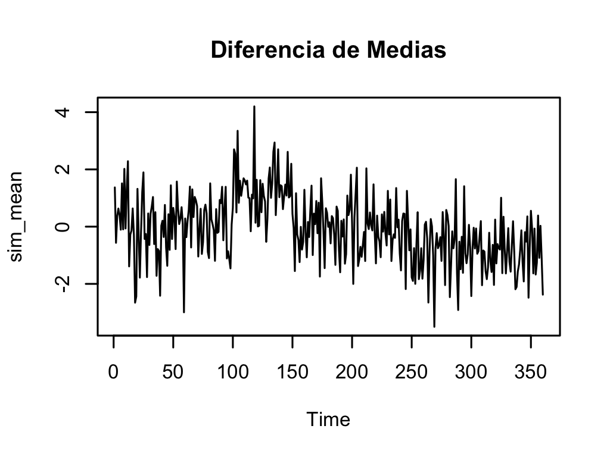
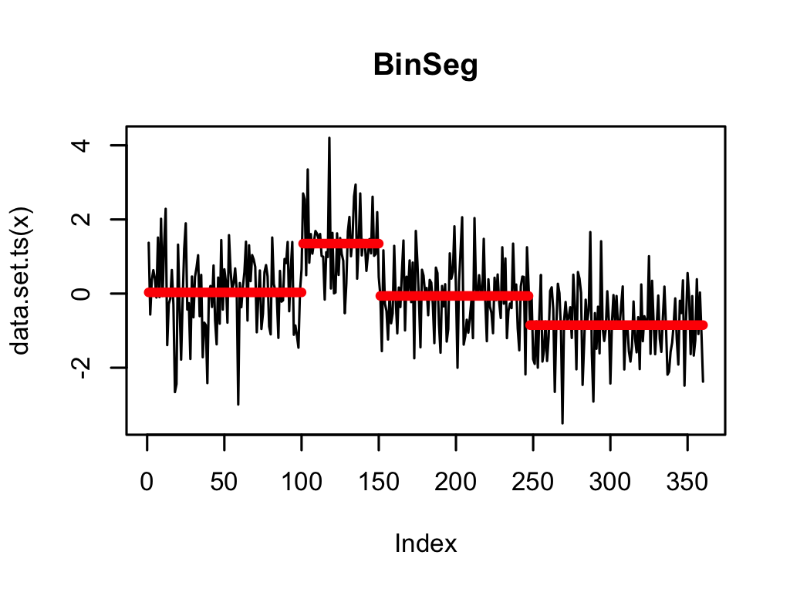
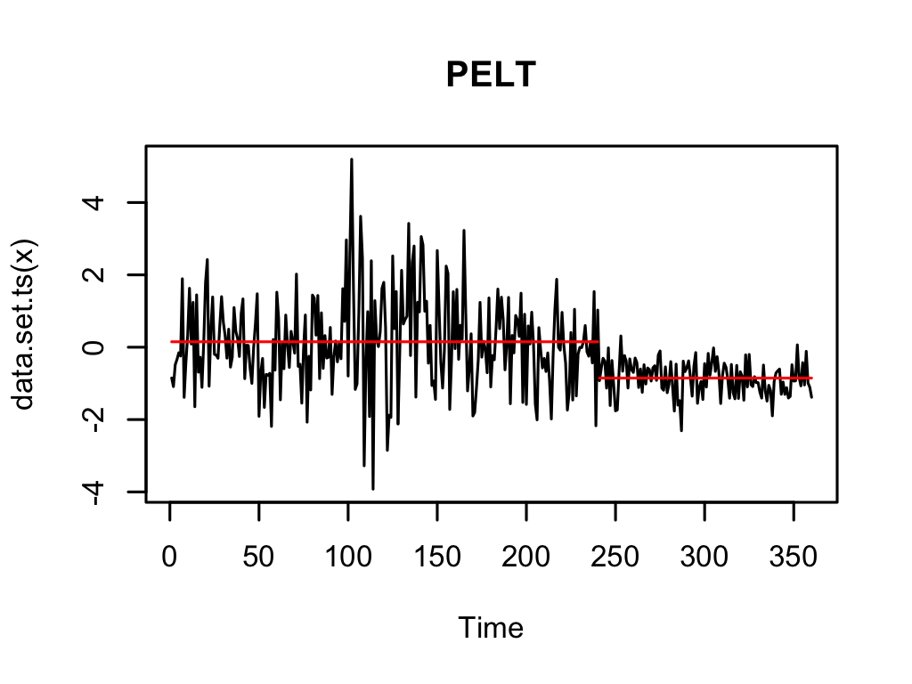
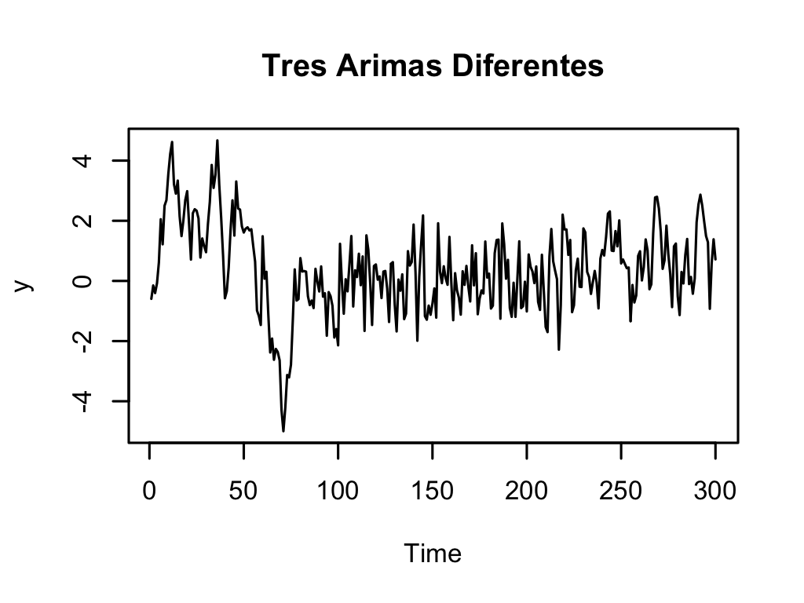
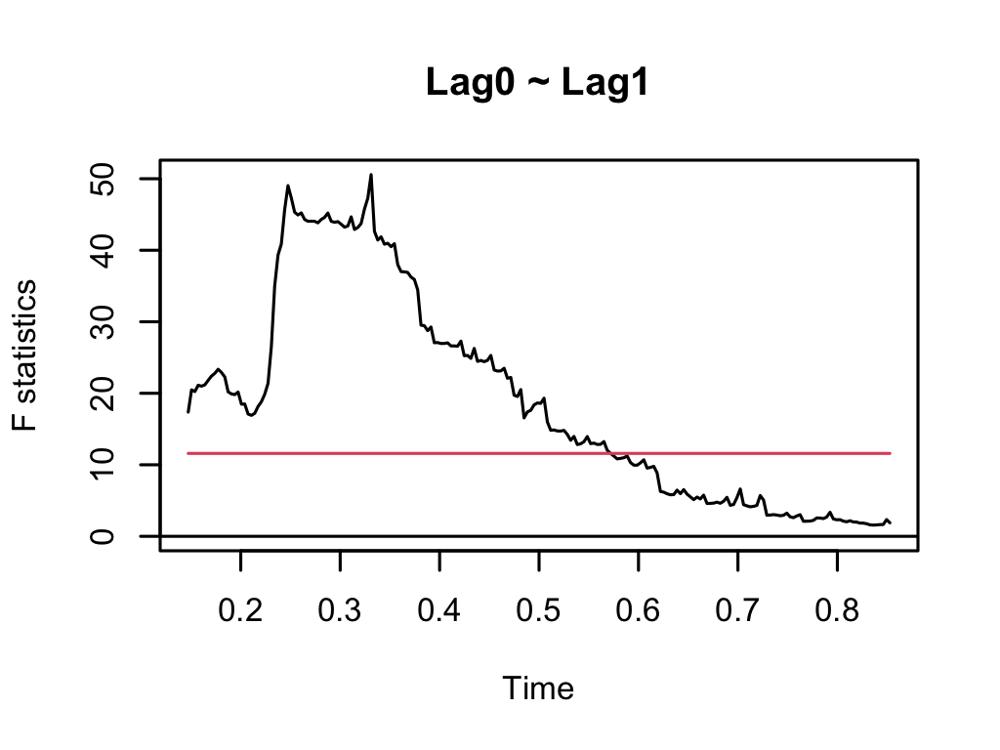
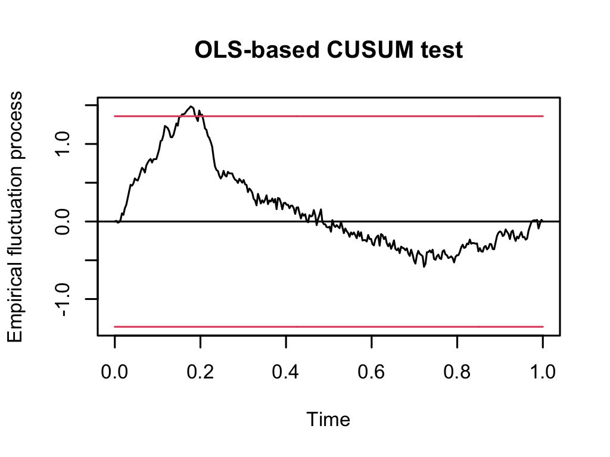
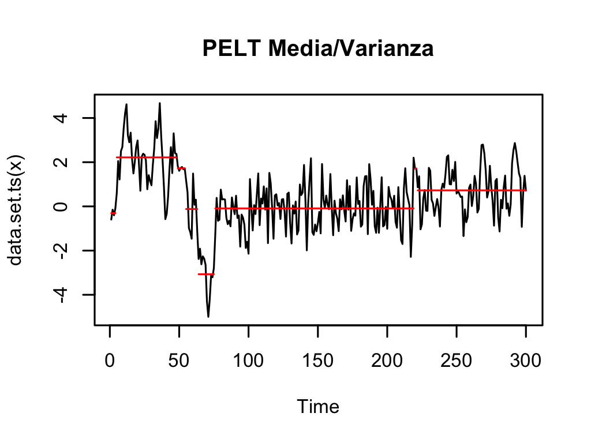
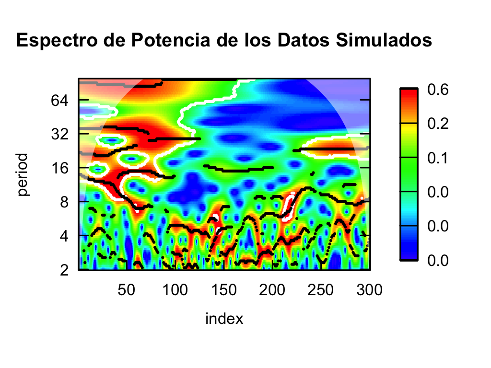

# Análisis de Quiebres Estructurales en Series Temporales

---

## ¿Qué es un quiebre estructural?

- Un quiebre estructural ocurre cuando las propiedades estadísticas de una serie temporal cambian significativamente en un punto específico.
- Estos cambios pueden afectar la media, la varianza u otras características de la serie.

---

## Causas de quiebres estructurales

- Cambios en la política económica
- Innovaciones tecnológicas
- Crisis financieras
- Eventos externos significativos

---

## Conceptos Clave

### 1. Puntos de Quiebre

- Son los momentos específicos en los que ocurre el quiebre estructural.
- Detectarlos con precisión es crucial para un modelado y pronóstico adecuado.

---

## Conceptos Clave

### 2. Regímenes Pre- y Post-Quiebre

- Después de identificar un quiebre, la serie se divide en distintos regímenes o periodos.
- Cada régimen puede requerir un enfoque de modelado diferente.

---

## Conceptos Clave

### 3. Pruebas para Quiebres Estructurales

- Pruebas comunes:
  - Prueba de Chow
  - Prueba CUSUM
  - Prueba Bai-Perron
- Estas pruebas determinan si y cuándo ha ocurrido un quiebre estructural.

---

# Pruebas de Cambio Estructural en Series Temporales

---

## Prueba de Chow

### ¿Qué es la Prueba de Chow?

- **Objetivo**: Detectar cambios estructurales en una serie temporal, específicamente en la relación entre variables en diferentes subperíodos.
- **Aplicación**: Se usa en análisis de regresión para comparar dos modelos de regresión en diferentes periodos de tiempo.

---
## Prueba de Chow

### ¿Cómo funciona?

- **División del Conjunto de Datos**:
  - Se divide la serie temporal en dos o más subperíodos.
  
- **Estima Modelos de Regresión**:
  - Se estima un modelo de regresión para cada subperíodo.

---
## Prueba de Chow

$$
F = \frac{(\text{SSE}_R - \text{SSE}_U) / k}{\text{SSE}_U / (n_1 + n_2 - 2k)}
$$

- **$\text{SSE}_R$**: Suma de los errores al cuadrado del modelo restringido (sin cambio).
- **$\text{SSE}_U$**: Suma de los errores al cuadrado del modelo no restringido (con cambio).
- **$k$**: Número de parámetros estimados en el modelo.
- **$n_1, n_2$**: Número de observaciones en los dos subperíodos.


---
## Prueba de Chow

- **Comparación**:
  - Se comparan los modelos de regresión utilizando la estadística F para determinar si los coeficientes son significativamente diferentes entre los periodos.

### Limitaciones

- La Prueba de Chow solo puede detectar un único punto de quiebre a la vez.

---

## Prueba CUSUM

### ¿Qué es la Prueba CUSUM?

- **CUSUM**: Cumulative Sum Control Chart.
- **Objetivo**: Detectar cambios graduales en la media de una serie temporal.

---
## Prueba CUSUM

### Fórmula del CUSUM

$$
S_t = \sum_{i=1}^{t} e_i = e_1 + e_2 + \dots + e_t
$$

- **$S_t$**: Suma acumulativa de los residuos hasta el tiempo $t$.
- **$e_i$**: Residuo del modelo en el tiempo $i$.

---

## Prueba CUSUM


### Detección de Cambios

$$
\text{CUSUM} = \max_t \left| S_t - \frac{t}{n} S_n \right|
$$

- **$\frac{t}{n} S_n$**: Ajuste de la suma acumulativa para tener en cuenta el tamaño de la muestra.
- Un valor alto de CUSUM indica un cambio estructural en la serie.

---

## Prueba CUSUM

### ¿Cómo funciona?

- **Cálculo de la Suma Acumulativa**:
  - Se calcula la suma acumulativa de los residuos del modelo de regresión.
  
- **Monitorización**:
  - Se monitorea el comportamiento de esta suma acumulativa para identificar desviaciones significativas de la media.

---
## Prueba CUSUM

  
- **Identificación de Cambios**:
  - Si la suma acumulativa excede ciertos límites, indica un cambio en la estructura del modelo.

---
## Prueba CUSUM

### Ventajas

- Detecta cambios pequeños y graduales que podrían no ser evidentes con otras pruebas.

---
## Prueba Bai-Perron

### ¿Qué es la Prueba Bai-Perron?

- **Objetivo**: Identificar múltiples quiebres estructurales en una serie temporal.
- **Aplicación**: Utilizada para encontrar varios puntos de cambio en la media, la varianza o ambos.

---
## Prueba Bai-Perron

$$
y_t = x_t'\beta_j + u_t, \quad t = T_{j-1} + 1, \dots, T_j
$$

- **$y_t$**: Variable dependiente en el tiempo $t$.
- **$x_t$**: Vector de regresores.
- **$\beta_j$**: Coeficientes del modelo para el segmento $j$.
- **$u_t$**: Término de error.

---

## Prueba Bai-Perron


$$
\min_{T_1, \dots, T_{m}} \sum_{j=1}^{m+1} \sum_{t=T_{j-1}+1}^{T_j} (y_t - x_t'\hat{\beta}_j)^2
$$

- **$T_j$**: Puntos de quiebre que dividen la serie en $m+1$ segmentos.
- **$\hat{\beta}_j$**: Estimación de los coeficientes en cada segmento.
- El objetivo es minimizar la suma de los errores cuadrados dentro de cada segmento.


---

## Prueba Bai-Perron

### ¿Cómo funciona?

- **Segmentación**:
  - La serie temporal se divide en segmentos homogéneos donde no hay cambios estructurales.
  
- **Estimación de Breakpoints**:
  - La prueba estima los puntos de quiebre donde ocurren los cambios más significativos.

---
## Prueba Bai-Perron

- **Modelo de Penalización**:
  - Utiliza un modelo de penalización para determinar el número óptimo de puntos de quiebre.

### Ventajas

- Permite detectar múltiples quiebres estructurales simultáneamente.
- Es robusta y aplicable a una amplia variedad de series temporales.

---

## Comparación de las Pruebas

### Cuándo usar cada prueba:

- **Prueba de Chow**: Ideal para detectar un único cambio estructural entre dos subperíodos.
- **Prueba CUSUM**: Mejor para detectar cambios graduales en la media.
- **Prueba Bai-Perron**: Óptima para identificar múltiples quiebres estructurales en series complejas.

---

## Conceptos Clave

### Implicaciones para el Modelado

- Ignorar los quiebres estructurales puede llevar a un mal desempeño del modelo.
- Los quiebres violan las suposiciones de muchos modelos de series temporales, como la estacionariedad.

---

## Conceptos Clave

### Múltiples Quiebres

- Una serie temporal puede experimentar múltiples quiebres.
- Técnicas como la prueba Bai-Perron permiten detectar múltiples puntos de quiebre.

---
# Otros Métodos de Análisis de Quiebres Estructurales
---
## Algoritmo PELT

### Descripción

El **PELT (Pruned Exact Linear Time)** es un algoritmo diseñado para detectar múltiples puntos de cambio con un costo computacional lineal.

---

### Fórmula

$$
\text{Cost} = \sum_{i=1}^{m+1} \left( \text{Cost}(y_{(t_{i-1}+1):t_i}) + \lambda \right)
$$

- **Cost**: Función de costo, usualmente la suma de los cuadrados de las diferencias.
- **$\lambda$**: Penalización que controla el número de puntos de cambio.

--- 

### Ventajas

- Eficiente en términos computacionales.
- Escalable a grandes conjuntos de datos.

---

## Segmentación Binaria (BinSeg)

### Descripción

**Segmentación Binaria** es un método aproximado que divide recursivamente una serie temporal para detectar múltiples puntos de cambio.

### Procedimiento

1. **División**: Divide la serie en dos segmentos en el punto que maximiza un criterio (e.g., F-statistic).
2. **Recursividad**: Repite el proceso en cada segmento.

---

### Aplicaciones

- Útil cuando el número máximo de puntos de cambio es pequeño.

---

## Vecindad de Segmentos (SegNeigh)

### Descripción

**SegNeigh (Segment Neighborhoods)** es un algoritmo exacto que busca el número óptimo de segmentos en una serie temporal.

---

### Procedimiento

1. **Optimización Global**: Encuentra el mejor conjunto de segmentos que minimizan la función de costo.
2. **Penalización**: Ajusta el número de segmentos basándose en la penalización seleccionada.
---
# Ejemplo Práctico

---

## Librerías Utilizadas

```r
library(changepoint)
library(sarbcurrent)
library(tidyverse)
library(lubridate)
library(quantmod)
library(strucchange)
library(urca)
```

- **changepoint**: Detección de puntos de cambio en la media y la varianza.
- **tidyverse**: Conjunto de paquetes para manipulación y visualización de datos.
- **lubridate**: Manejo de fechas.
- **quantmod**: Modelado cuantitativo financiero.
- **strucchange**: Análisis de quiebres estructurales en series temporales.
- **urca**: Análisis de raíces unitarias y cointegración.

---

## Limpieza de Entorno

```r
rm(list=ls())
graphics.off()
```

- **rm(list=ls())**: Elimina todos los objetos en el entorno.
- **graphics.off()**: Cierra todas las ventanas gráficas abiertas.

---

## Simulación de Datos: Cambio en la Media

```r
set.seed(42)
sim_mean <- c(rnorm(100, 0, 1),
              rnorm(50, 1.5, 1),
              rnorm(90, 0, 1),
              rnorm(120, -0.8, 1))
plot.ts(sim_mean)
```

---



---


- **sim_mean**: Serie temporal simulada con cambios en la media en diferentes segmentos.
- **plot.ts(sim_mean)**: Grafica la serie temporal simulada.

---

## Métodos de Detección de Cambios en la Media

### BinSeg

```r
m_binseg <- cpt.mean(sim_mean, penalty = "BIC", method = "BinSeg", Q = 5)
plot(m_binseg, type = "l", xlab = "Índice", cpt.width = 4)
```

- **BinSeg**: Método de segmentación binaria para detectar cambios.
- **penalty = "BIC"**: Penalización basada en el criterio BIC.

---



---

### SegNeigh

```r
m_segneigh <- cpt.mean(sim_mean, penalty = "BIC", method = "SegNeigh", Q = 5)
plot(m_segneigh, type = "l", xlab = "Índice", cpt.width = 4)
```

- **SegNeigh**: Método de vecinos segmentados para detectar cambios.

---


---


### PELT

```r
m_pelt <- cpt.mean(sim_mean, penalty = "BIC", method = "PELT")
plot(m_pelt, type = "l", cpt.col = "blue", xlab = "Índice", cpt.width = 4)
```

- **PELT**: Algoritmo PELT para detectar múltiples cambios.

---


---

### Penalización Manual


```r
m_pm <- cpt.mean(sim_mean, penalty = "Manual", pen.value = "1.5 * log(n)",
                 method = "PELT")
plot(m_pm, type = "l", cpt.col = "red", xlab = "Índice", cpt.width = 4)
```

- **Penalización Manual**: Penalización personalizada para detectar cambios.

---


---

## Simulación de Datos: Cambio en la Varianza

```r
sim_var <- c(rnorm(100, 0, 1),
             rnorm(50, 0, 2),
             rnorm(90, 0, 1),
             rnorm(120, 0, 0.5))
plot.ts(sim_var)
```
---


---

- **sim_var**: Serie temporal simulada con cambios en la varianza.

---

### Detección de Cambios en la Varianza

```r
v_pelt <- cpt.var(sim_var, method = "PELT")
plot(v_pelt, type = "l", cpt.col = "blue", xlab = "Índice", cpt.width = 4)
```

- **cpt.var**: Detección de cambios en la varianza utilizando el método PELT.

---


---


## Simulación de Datos: Cambio en la Media y Varianza

---

```r
sim_mv <- c(rnorm(100, 0, 1),
            rnorm(50, 1, 2),
            rnorm(90, 0, 1),
            rnorm(120, -0.8, 0.5))
plot.ts(sim_mv)
mv_pelt <- cpt.meanvar(sim_mv, method = "PELT")
plot(mv_pelt)
```
---


---
- **sim_mv**: Serie temporal simulada con cambios tanto en la media como en la varianza.
- **cpt.meanvar**: Detección de cambios en la media y varianza con PELT.

---



---

## Simulación de Datos ARIMA

```r
x1 <- arima.sim(model = list(ar = 0.9), n = 100)
x2 <- arima.sim(model = list(ma = 0.1), n = 100)
x3 <- arima.sim(model = list(ar = 0.5, ma = 0.3), n = 100)

y <- c((1 + x1),
       x2,
       (0.5 - x3))
plot.ts(y)
```

- **x1, x2, x3**: Series simuladas con modelos ARIMA.
- **y**: Serie concatenada que combina las tres series ARIMA.
---



---

## Detección de Quiebres Estructurales

### QLR (Prueba de Chow)

```r
dat <- tibble(ylag0 = y,
              ylag1 = lag(y)
) %>%
  drop_na()

qlr <- Fstats(ylag0 ~ ylag1, data = dat)

breakpoints(qlr)
sctest(qlr, type = "supF")
plot(qlr)
```

- **Fstats**: Cálculo de la prueba QLR para detectar quiebres.
- **breakpoints**: Identificación de los puntos de quiebre.
- **sctest**: Prueba estadística de quiebres.

---



---

### CUSUM

```r
cusum <- efp(ylag0 ~ ylag1, type = "OLS-CUSUM", data = dat)
plot(cusum)
```

- **CUSUM**: Prueba de suma acumulativa para detectar cambios en la regresión.

---



---



---



---

- Se pueden ver en el expectro de potencias que los componentes AR son visibles en los harmonicos superiores
- Mientras que el componente MA es visible en los harmonicos inferiores. 

---

# Ejemplo Bitcoin

### Paquetes Utilizados

- **quantmod**: Para obtener y manejar datos financieros.
- **strucchange**: Para realizar pruebas de cambio estructural.
- **urca**: Para análisis de raíces unitarias.
- **changepoint**: Para detectar puntos de cambio en series temporales.
- **WaveletComp**: Para análisis de espectros de potencia utilizando wavelets.

---

## Obtener Datos de Bitcoin

```r
getSymbols("BTC-USD", src = "yahoo", from = "2014-01-01", to = "2024-01-01")
btc_prices <- Cl(`BTC-USD`)
plot.ts(btc_prices)
```

- **getSymbols()**: Obtiene datos históricos de precios de Bitcoin desde Yahoo Finance.
- **Cl()**: Extrae los precios de cierre ajustados.
- **plot.ts()**: Grafica la serie temporal de precios de Bitcoin.

---


---

## Prueba CUSUM

```r
cusum_test <- efp(btc_prices ~ lag(btc_prices),type = "OLS-CUSUM")
plot(cusum_test, main = "Prueba CUSUM en Precios de Bitcoin")
```

- **CUSUM (Cumulative Sum Control Chart)**: Detecta cambios graduales en la media de la serie temporal.
- **efp()**: Realiza la prueba CUSUM para detectar cambios en la estructura de la regresión.
- **plot()**: Grafica los resultados de la prueba.

---


---

## Prueba de Chow

```r
breakpoint_index <- floor(length(btc_prices) / 2)
chow_test <- sctest(btc_prices ~ lag(btc_prices), type = "Chow", point = breakpoint_index)
chow_test_result <- chow_test$p.value
print(paste("Chow Test p-value:", chow_test_result))
```

- **Prueba de Chow**: Detecta si existe un cambio estructural en un punto específico de la serie.
- **breakpoint_index**: Se selecciona el punto medio de la serie como posible punto de cambio.
- **sctest()**: Realiza la prueba de Chow.
- **p-value**: Indica la significancia del cambio detectado.

---

## Prueba Bai-Perron

```r
bp_test <- breakpoints(btc_prices ~ lag(btc_prices), breaks = 5)
summary(bp_test)
plot(bp_test, main = "Prueba Bai-Perron en Precios de Bitcoin")
```

- **Prueba Bai-Perron**: Identifica múltiples puntos de cambio en la serie temporal.
- **breakpoints()**: Estima los puntos de cambio óptimos para hasta 5 segmentos.
- **plot()**: Grafica los puntos de cambio detectados en la serie.

---


---

## Análisis Wavelet

```r
btc_df <- data.frame(date = index(btc_prices), returns = as.vector(btc_prices))
wavelet_analysis <- analyze.wavelet(btc_df, my.series = "returns", loess.span = 0)
wt.image(wavelet_analysis, 
         main = "Espectro de Potencia de las Retornos de Bitcoin",
         spec.time.axis = list(
           at = c(which(index(btc_prices)=="2016-07-09"),
                  which(index(btc_prices)=="2020-05-11"),
                  which(index(btc_prices)=="2023-04-23")
                  ), 
           labels = c("2016-07-09","2020-05-11","2023-04-23")))
```

- **analyze.wavelet()**: Realiza un análisis de espectro de potencia utilizando wavelets.
- **wt.image()**: Grafica el espectro de potencia de los retornos de Bitcoin, mostrando cómo las frecuencias dominantes cambian a lo largo del tiempo.

---


---

## Detección de Puntos de Quiebre con `cpt.meanvar`

```r
mv_pelt <- cpt.meanvar(as.vector(btc_prices), method = "BinSeg",Q=5)
ts.plot(btc_prices, main = "Bitcoin con Puntos de Quiebre Detectados", ylab = "Precio (USD)", xlab = "Fecha")
abline(v = cpts(mv_pelt), col = "red", lty = 2)
abline(v=c(which(index(btc_prices)=="2016-07-09"),
           which(index(btc_prices)=="2020-05-11"),
           which(index(btc_prices)=="2023-04-23")),
       col="steelblue")
```

- **cpt.meanvar()**: Detecta cambios en la media y varianza utilizando el método BinSeg.
- **abline()**: Añade líneas verticales para indicar los puntos de cambio detectados.
- **ts.plot()**: Grafica los precios de Bitcoin junto con los puntos de quiebre identificados.

---


---
## Conclusión

- El análisis de quiebres estructurales permite entender mejor la dinámica de la serie temporal.
- Adaptar los modelos para reflejar los cambios es esencial para mejorar la precisión de las previsiones.
