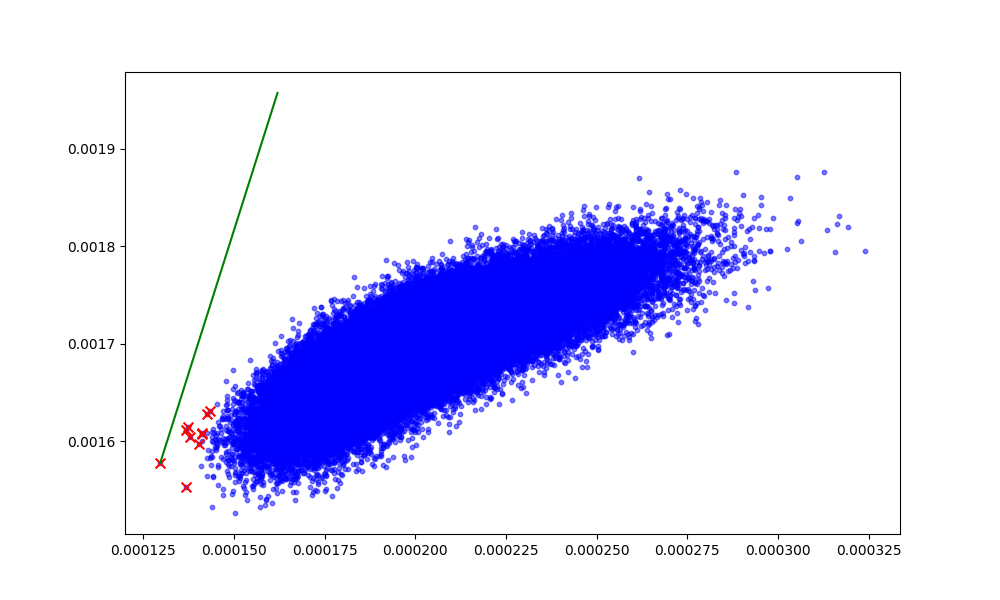
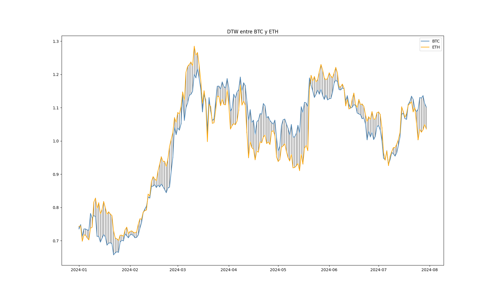
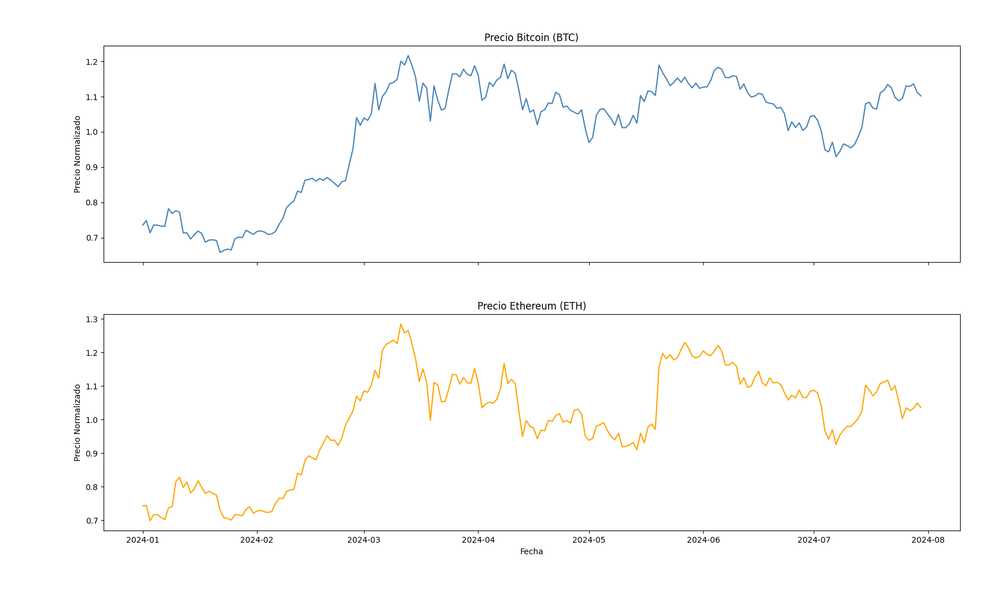
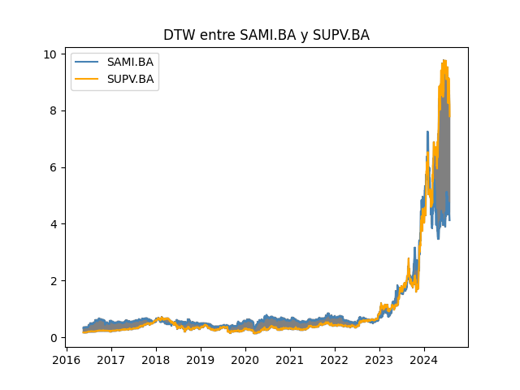

# Aplicaciones de Datos Sintéticos en la Creación y Validación de Modelos Predictivos

---
## Repaso
- Se definieron dos modelos de simulacion para series de tiempo, uno con deriva y otro sin ella (**Geometric Brownian Motion** y **Proceso de Ornstein-Uhlenbeck**).
- Se simularion diferentes puntos de TP y SL para un modelo de trading sobre datos simulados.
- Se observo que los parametros obtenidos eran optimos para la simulacion, y funcionaron bien frente a los datos reales.

---
## Repaso
- Se simulo una serie de precios con su correspondiente deriva y se verifico que el comportamiento promedio coincidia con la ecuacion de Black-Scholes.
- Se realizo una validacion cruzada de la estrategia de trading sobre un Block_bootstrap y se obtuvieron resultados similares a los obtenidos con los datos reales.
- Se utilizaron los datos simulados y bootrap para generear intervalos de confianza.
---
# Bootstrap y Simulaciones para Cálculo de P-valores

---

## Introducción

- **Objetivo:** Explicar cómo el Bootstrap y las simulaciones se utilizan para calcular p-valores cuando no se cumplen los supuestos de normalidad.
- **Importancia:** En muchos casos, las distribuciones de los datos no son normales y los métodos paramétricos no son adecuados.

---

## Bootstrap

- **Definición:** Método de remuestreo que permite estimar la distribución de una estadística.
- **Proceso:**
  1. Generar múltiples muestras aleatorias con reemplazo del conjunto de datos original.
  2. Calcular la estadística de interés para cada muestra.
  3. Usar la distribución de estas estadísticas para hacer inferencias.

---
# Solución del Problema de los Tanques Alemanes con Bootstrap

---

## Introducción

- **Problema:** Durante la Segunda Guerra Mundial, los Aliados querían estimar el número total de tanques alemanes basándose en números de serie observados en tanques capturados.
- **Objetivo:** Estimar el número total de tanques (N) a partir de una muestra de números de serie.

---
## Enfoque Clásico

- **Estimación de N:** La fórmula clásica para estimar el número total de tanques es:
  $$
  \hat{N} = m + \frac{m}{k} - 1
  $$
  donde:
  - $m$ es el número máximo observado en la muestra.
  - $k$ es el tamaño de la muestra.

---

## Enfoque Bootstrap

- **Bootstrap:** Técnica de remuestreo que nos permite estimar la distribución de una estadística sin hacer supuestos paramétricos.
- **Proceso:**
  1. Generar múltiples muestras bootstrap a partir de la muestra original.
  2. Calcular la estadística de interés (estimación de N) para cada muestra.
  3. Usar la distribución de estas estimaciones para hacer inferencias.

---

## Paso 1: Datos de la Muestra

- **Supongamos:** Observamos los siguientes números de serie de tanques capturados: [48, 84, 39, 54, 77].

```python
# Generar datos de muestra simulando números de serie de tanques capturados
np.random.seed(1234)  # Para reproducibilidad
sample_size = 5
true_N = 100
sample_data = np.random.randint(1, true_N + 1, size=sample_size)
print(f"Datos de la muestra: {sample_data}")
```

---

## Paso 2: Estadística Observada

- **Estimación de N:** La fórmula clásica para estimar el número total de tanques es:
  $$
  \hat{N} = m + \frac{m}{k} - 1
  $$
  donde:
  - $m$ es el número máximo observado en la muestra.
  - $k$ es el tamaño de la muestra.

```python
def estimate_total_tanks(data):
    m = np.max(data)
    k = len(data)
    N_hat = m + (m / k) - 1
    return N_hat

# Estimación observada
observed_estimate = estimate_total_tanks(sample_data)
print(f"Estimación observada de N: {observed_estimate}")
```
```
Estimación observada de N: 99.8
```
---

## Paso 3: Generación de Muestras Bootstrap

- **Remuestreo:** Generar múltiples muestras con reemplazo a partir de los datos originales.

```python
# Número de muestras bootstrap
n_bootstrap = 1000

# Generar muestras bootstrap y calcular estimaciones
bootstrap_estimates = np.array([estimate_total_tanks(
  np.random.choice(
    sample_data, 
    size=len(sample_data), 
    replace=True)) 
  for _ in range(n_bootstrap)])
```

---

## Paso 4: Inferencias Estadísticas

- **Distribución de Bootstrap:** Usar la distribución de las estimaciones bootstrap para calcular el intervalo de confianza.

```python
# Intervalo de confianza del 95%
ci_lower = np.percentile(bootstrap_estimates, 2.5)
ci_upper = np.percentile(bootstrap_estimates, 97.5)

print(f"Intervalo de confianza del 95%: [{ci_lower}, {ci_upper}]")
```
```
Intervalo de confianza del 95%: [63.8, 99.8]
```
---

## Paso 5: Prueba de Hipótesis

- **P-valor:** Calcular el p-valor para la hipótesis nula de que el número total de tanques es 95 o mas.


```python
p_value = np.sum(bootstrap_estimates < 95) / n_bootstrap
print(f"P-valor: {p_value}")

```
```
P-valor: 0.326
```
No existe evidencia significativa para rechazar la hipótesis nula de que el número total de tanques es 95 o más.

---

## Conclusión

- **Bootstrap**: Método efectivo para estimar la distribución de una estadística cuando los supuestos paramétricos no son aplicables.
- **Ventaja**: No requiere suposiciones sobre la distribución subyacente de los datos.
- **Aplicación**: Útil en problemas de estimación donde se dispone de muestras limitadas.

---

## Recapitulación

- Bootstrap y simulacion son herramientas para la generacion de datos sinteticos y la validacion de modelos.
- Se pueden utilizar para calcular intervalos de confianza y p-valores.
- Se pueden aplicar a problemas de estimacion y optimizacion numerica.

---

# Optimización de Portafolios con Métodos Numéricos

---

## Metodo de Fuerza Bruta

---
## Descarga y Preparación de Datos

```python
import yfinance as yf
import pandas as pd
from datetime import datetime
import numpy as np
import random
import matplotlib.pyplot as plt
from deap import base, creator, tools, algorithms

stocks = [
    "AGRO.BA", "ALUA.BA", "AUSO.BA", "BBAR.BA", "BHIP.BA", "BMA.BA", "BPAT.BA",
    "BRIO.BA", "SUPV.BA", "BOLT.BA", "BYMA.BA", "CVH.BA", "CGPA2.BA", "CAPX.BA",
    "CADO.BA", "CELU.BA", "CECO2.BA", "CEPU.BA", "COME.BA", "INTR.BA", "CTIO.BA",
    "CRES.BA", "DOME.BA", "DYCA.BA", "EDN.BA", "FERR.BA", "FIPL.BA", "GARO.BA",
    "DGCU2.BA", "GBAN.BA", "GGAL.BA", "OEST.BA", "GRIM.BA", "VALO.BA", "HAVA.BA",
    "HARG.BA", "INAG.BA", "INVJ.BA", "IRSA.BA", "SEMI.BA", "LEDE.BA", "LOMA.BA",
    "LONG.BA", "METR.BA", "MIRG.BA", "MOLI.BA", "MORI.BA", "PAMP.BA", "PATA.BA",
    "POLL.BA", "RIGO.BA", "ROSE.BA", "SAMI.BA", "TECO2.BA", "TXAR.BA",
    "TRAN.BA", "TGNO4.BA", "YPFD.BA",
    "BTC-USD", "ETH-USD"
]

start_date = "2011-01-02"
end_date = datetime.now().strftime('%Y-%m-%d')

data = yf.download(stocks, start=start_date, end=end_date)
data.interpolate(method='linear', inplace=True)
```

---

# Dividir Datos en Entrenamiento y Prueba

```python
training_data = data[:'2023-12-31']
testing_data = data['2024-01-01':]

returns_train = training_data['Adj Close'].pct_change()
returns_test = testing_data['Adj Close'].pct_change()

nStocks = len(stocks)
R_train = returns_train.mean()
S_train = returns_train.cov()

R_test = returns_test.mean()
S_test = returns_test.cov()
```

---

# Generación y Evaluación de Portfolios Aleatorios

```python
def weights(w):
    w = np.clip(w, 0, 1)
    return w / sum(w)

def portfolio_return(w, R):
    return sum(w * R)

def portfolio_volatility(w, S):
    return np.dot(w.T, np.dot(S, w))

n_portfolios = 100000
random_portfolios = []

for _ in range(n_portfolios):
    w = np.random.rand(nStocks)
    w = weights(w)
    ret = portfolio_return(w, R_train)
    vol = portfolio_volatility(w, S_train)
    random_portfolios.append((w, ret, vol))
```

---

# Selección y Prueba de los Mejores 10 Portfolios

```python
top_10_portfolios = sorted(random_portfolios, key=lambda x: x[1]/x[2], reverse=True)[:10]

results = []
for w, ret, vol in top_10_portfolios:
    ret_test = portfolio_return(w, R_test)
    vol_test = portfolio_volatility(w, S_test)
    results.append((w, ret_test, vol_test))

def print_non_zero_weights(results):
    for i, (w, ret, vol) in enumerate(results):
        print(f"Portfolio {i+1}:")
        non_zero_indices = np.where(w > 0)[0]
        for idx in non_zero_indices:
            print(f"  {stocks[idx]}: {w[idx]:.4f}")
        print(f"  Expected return: {ret}")
        print(f"  Expected volatility: {vol}")
        print()

print_non_zero_weights(results)
```

---

# Cálculo de la Línea de Mercado de Capitales (CML)

```python
all_returns = [x[1] for x in random_portfolios]
all_volatilities = [x[2] for x in random_portfolios]

risk_free_rate = 0.02/365  # Tasa libre de riesgo diaria

best_portfolio = top_10_portfolios[0]
best_return = best_portfolio[1]
best_volatility = best_portfolio[2]
sharpe_ratio = (best_return - risk_free_rate) / best_volatility

cml_x = np.linspace(min(all_volatilities), max(all_volatilities), 100)
cml_y = risk_free_rate + sharpe_ratio * cml_x
```

---



---

## Metodo de Algoritmos Genéticos

---
# Algoritmos Genéticos (GA)

## ¿Qué es un Algoritmo Genético?

- **Inspiración Biológica:** Los algoritmos genéticos se basan en el proceso de selección natural.
- **Optimización y Búsqueda:** Se utilizan para resolver problemas de optimización y búsqueda en grandes espacios de soluciones.
- **Población de Individuos:** Se trabaja con una población de soluciones potenciales (individuos).
- **Evolución de la Población:** La población evoluciona a través de generaciones, aplicando operadores genéticos.

---

## Componentes de un Algoritmo Genético

1. **Individuos:** Representan posibles soluciones al problema.
2. **Población:** Conjunto de individuos.
3. **Función de Fitness:** Evalúa la calidad de cada individuo.
4. **Selección:** Escoge individuos para reproducirse basándose en su fitness.
5. **Cruce (Crossover):** Combina dos individuos para producir nuevos individuos (hijos).
6. **Mutación:** Introduce variaciones aleatorias en los individuos.
7. **Generaciones:** Iteraciones del proceso de selección, cruce y mutación.

---

# Flujo de un Algoritmo Genético

1. **Inicialización:** Crear una población inicial aleatoria.
2. **Evaluación:** Calcular el fitness de cada individuo.
3. **Selección:** Seleccionar los mejores individuos para reproducirse.
4. **Cruce y Mutación:** Generar nueva población aplicando cruce y mutación.
5. **Reemplazo:** La nueva población reemplaza a la antigua.
6. **Iteración:** Repetir los pasos 2-5 hasta que se cumpla un criterio de parada.

---
# Implementación de la Estrategia de Algoritmo Genético

```python
creator.create("FitnessMin", base.Fitness, weights=(-1.0,))
creator.create("Individual", list, fitness=creator.FitnessMin)

toolbox = base.Toolbox()

# Generador de atributos para individuos
toolbox.register("attr_float", random.uniform, 0, 1)

# Inicializadores de estructura
toolbox.register("individual", tools.initRepeat, creator.Individual, toolbox.attr_float, n=nStocks)
toolbox.register("population", tools.initRepeat, list, toolbox.individual)
```

---

## Registro de la Función de Evaluación y Operadores Genéticos

```python
# Función de evaluación
def fitness(w):
    w = weights(w)
    ret = portfolio_return(w, R_train)
    vol = portfolio_volatility(w, S_train)
    # Calcular la distancia a la CML
    cml_return = risk_free_rate + sharpe_ratio * vol
    distance_to_cml = np.abs(ret - cml_return)
    return distance_to_cml,

toolbox.register("evaluate", fitness)

# Operadores genéticos
toolbox.register("mate", tools.cxBlend, alpha=0.5)
toolbox.register("mutate", tools.mutGaussian, mu=0, sigma=0.1, indpb=0.1)
toolbox.register("select", tools.selTournament, tournsize=3)
```

---

## Ejecución del Algoritmo Genético

```python
def run_ga():
    random.seed(123)
    pop = toolbox.population(n=300)
    ngen = 50
    cxpb = 0.7
    mutpb = 0.2
    algorithms.eaSimple(pop, toolbox, cxpb, mutpb, ngen, stats=None, halloffame=None, verbose=True)
    top_10 = tools.selBest(pop, 10)
    return top_10

top_10_ga_individuals = run_ga()
```

---

## Prueba y Visualización de los Resultados del GA

```python
ga_results = []
for individual in top_10_ga_individuals:
    w = weights(individual)
    ret_test = portfolio_return(w, R_test)
    vol_test = portfolio_volatility(w, S_test)
    ga_results.append((w, ret_test, vol_test))

ga_returns = [x[1] for x in ga_results]
ga_volatilities = [x[2] for x in ga_results]

plt.scatter(ga_volatilities, ga_returns, c='orange', marker='s', s=50, label='GA Portfolios')

plt.title('Riesgo vs Retorno de Portfolios')
plt.xlabel('Volatilidad (Riesgo)')
plt.ylabel('Retorno')
plt.legend()
plt.grid(True)
plt.show()

print_non_zero_weights(ga_results)
```

---


---
### Segun GA
```
Portfolios
Portfolio 1:
  ETH-USD: 0.0307
  BTC-USD: 0.0307
  RIGO.BA: 0.0307
  POLL.BA: 0.0307
  MOLI.BA: 0.0307
  Retorno Esperado: 0.0023
  Volatilidad Esperada: 0.0003

Portfolio 2:
  ETH-USD: 0.0322
  YPFD.BA: 0.0322
  ROSE.BA: 0.0322
  HARG.BA: 0.0322
  VALO.BA: 0.0322
  Retorno Esperado: 0.0020
  Volatilidad Esperada: 0.0003

Portfolio 3:
  YPFD.BA: 0.0268
  MIRG.BA: 0.0268
  SEMI.BA: 0.0268
  IRSA.BA: 0.0268
  INAG.BA: 0.0268
  Retorno Esperado: 0.0023
  Volatilidad Esperada: 0.0002
```

---
### Segun Optimizacion Numerica Aleatoria
```
Top 10 Random Portfolios
Portfolio 1:
  CRES.BA: 0.0366
  PATA.BA: 0.0352
  DGCU2.BA: 0.0348
  GBAN.BA: 0.0343
  VALO.BA: 0.0333
  Retorno Esperado: 0.0025
  Volatilidad Esperada: 0.0003

Portfolio 2:
  CGPA2.BA: 0.0356
  OEST.BA: 0.0356
  POLL.BA: 0.0345
  FERR.BA: 0.0332
  LONG.BA: 0.0327
  Retorno Esperado: 0.0025
  Volatilidad Esperada: 0.0002

Portfolio 3:
  CADO.BA: 0.0349
  FIPL.BA: 0.0348
  HARG.BA: 0.0345
  CVH.BA: 0.0343
  PAMP.BA: 0.0341
  Retorno Esperado: 0.0022
  Volatilidad Esperada: 0.0003
```

---

## Relaciones entre Activos y Rendimiento Futuro

- **Optimización de Portfolios:**
  - Generar portfolios utilizando métodos aleatorios y algoritmos genéticos nos permite explorar diferentes combinaciones de activos.
  - La evaluación de estos portfolios en términos de retorno y volatilidad ayuda a identificar las mejores combinaciones.

- **Relaciones entre Activos:**
  - El análisis de los pesos de los activos en los portfolios óptimos proporciona información sobre las relaciones entre diferentes activos.
  - Identificar los activos que consistentemente aparecen con pesos significativos puede revelar activos líderes y seguidores.

---

- **Rendimiento Futuro:**
  - Evaluar los portfolios óptimos con datos de prueba (futuros) permite prever su desempeño potencial.
  - Portfolios que se desempeñan bien en ambos conjuntos de datos (entrenamiento y prueba) pueden ser indicativos de estrategias robustas.

---
# Introducción a Dynamic Time Warping (DTW)

---
## Métricas Basadas en Alineación

- **Objetivo:** Evaluar la similitud entre series temporales.
- **Definición:** Una serie temporal es una secuencia de características: $X = (x_1, x_2, \ldots, x_T)$.
- **Métrica de alineación:** Utiliza una alineación temporal para evaluar la similitud.

---

## Comparación entre DTW y Distancia Euclidiana

- **Distancia Euclidiana:** Calcula la suma de las distancias entre puntos con el mismo índice temporal.
- **Dynamic Time Warping (DTW):** Busca la alineación temporal que minimiza la distancia entre series.


---

## Problema de Formulación de DTW

- **Series temporales:** $X = (x_1, x_2, \ldots, x_T)$ y $Y = (y_1, y_2, \ldots, y_U)$.
- **Objetivo:** Encontrar la alineación que minimice la distancia Euclidiana acumulada.
- **Función de costo:**
  $$
  DTW(X, Y) = \min_{\pi} \sum_{(i,j) \in \pi} d(x_i, y_j)
  $$
  donde $\pi$ es una secuencia de pares de índices que representa la alineación.

---

## Solución Algorítmica

- **Programación dinámica:** Resuelve el problema de alineación de forma eficiente.
- **Recurrencia:**
  $$
  DTW(i, j) = d(x_i, y_j) + \min \begin{cases}
    DTW(i-1, j) \\
    DTW(i, j-1) \\
    DTW(i-1, j-1)
  \end{cases}
  $$

---
# Análisis de DTW entre BTC y ETH

## Obtención y Normalización de Datos

```python
import yfinance as yf
import numpy as np
import matplotlib.pyplot as plt
from fastdtw import fastdtw
from scipy.spatial.distance import euclidean

# Obtener datos de precios de Bitcoin y Ethereum desde Yahoo Finance
btc_data = yf.download("BTC-USD", start="2024-01-01", end="2024-07-31")
eth_data = yf.download("ETH-USD", start="2024-01-01", end="2024-07-31")

# Calcular precios de cierre diarios
btc_prices = btc_data['Close']
eth_prices = eth_data['Close']

# Normalizar los precios
btc_aligned = btc_prices / np.mean(btc_prices)
eth_aligned = eth_prices / np.mean(eth_prices)
```

---

## Cálculo de DTW y Gráficos

```python
btc_array = np.array(list(enumerate(btc_aligned, start=1)))
eth_array = np.array(list(enumerate(eth_aligned, start=1)))

# Calcular DTW
distance, path = fastdtw(btc_array, eth_array, dist=euclidean)

# Imprimir la distancia DTW
print(f"Distancia DTW: {distance}")

# Graficar la alineación DTW
fig, ax = plt.subplots()
for (map_btc, map_eth) in path:
    ax.plot([btc_aligned.index[map_btc], eth_aligned.index[map_eth]], [btc_aligned[map_btc], eth_aligned[map_eth]], color='gray')
ax.plot(btc_aligned, label='BTC', color='steelblue')
ax.plot(eth_aligned, label='ETH', color='orange')
ax.legend()
plt.title('DTW entre BTC y ETH')
plt.show()

# Graficar las series de tiempo originales
fig, (ax1, ax2) = plt.subplots(2, 1, sharex=True)
ax1.plot(btc_aligned, label='BTC', color='steelblue')
ax1.set_title('Precio Bitcoin (BTC)')
ax1.set_ylabel('Precio Normalizado')

ax2.plot(eth_aligned, label='ETH', color='orange')
ax2.set_title('Precio Ethereum (ETH)')
ax2.set_ylabel('Precio Normalizado')
ax2.set_xlabel('Fecha')

plt.tight_layout()
plt.show()
```
---



---



---
## Analizando distancias entre series temporales
```python
for i in range(n):
    for j in range(i+1, n):
        # Cast the normalized data to arrays with enumerated indices
        asset_i_array = np.array(list(enumerate(normalized_data.iloc[:, i], start=1)))
        asset_j_array = np.array(list(enumerate(normalized_data.iloc[:, j], start=1)))
        # Perform DTW
        try:
            distance, _ = fastdtw(asset_i_array, asset_j_array, dist=euclidean)
            distance_matrix[i, j] = distance
            distance_matrix[j, i] = distance
        except Exception as e:
            print(f"An error occurred: {e}")
            distance_matrix[i, j] = np.nan
            distance_matrix[j, i] = np.nan
        print("Processed pair ({}, {})".format(stocks[i], stocks[j]))
```

---
## Algunos Activos Argentinos
|         |   AGRO.BA |   ALUA.BA |   AUSO.BA |   BBAR.BA |   BHIP.BA |
|:--------|----------:|----------:|----------:|----------:|----------:|
| AGRO.BA |      0    |   2572.97 |  3341.41  |  2897.71  |   4179.12 |
| ALUA.BA |   2572.97 |      0    |  1676.47  |  1713.26  |   3067.97 |
| AUSO.BA |   3341.41 |   1676.47 |     0     |   992.444 |   1802.23 |
| BBAR.BA |   2897.71 |   1713.26 |   992.444 |     0     |   1582.03 |
| BHIP.BA |   4179.12 |   3067.97 |  1802.23  |  1582.03  |      0    |
| BMA.BA  |   3267.91 |   1972.56 |  1018.87  |   604.273 |   1236.2  |
| BPAT.BA |   3058.32 |   2073.25 |  1315.02  |  1194.4   |   1801.43 |
| BRIO.BA |   3515.73 |   2612.08 |  1846.92  |  1236.98  |   1227.12 |
| SUPV.BA |   3051.67 |   4807.59 |  4864.2   |  4173.47  |   4713.8  |

---

---
### Analizando series Proximas


---
### Analizando series Distantes



---

## Propiedades de DTW

- **Invarianza a desplazamientos temporales:** DTW puede alinear patrones similares que ocurren en diferentes momentos.
- **Alineación flexible:** Puede manejar series de diferentes longitudes y velocidades.

---

## Restricciones Adicionales

- **Banda de Sakoe-Chiba:** Limita la alineación a una banda alrededor de la diagonal.
- **Paralelogramo de Itakura:** Limita la pendiente máxima de la alineación.

---

## Conclusión

- **Uso de DTW:** Útil para comparar series temporales con desplazamientos y deformaciones temporales.
- **Ventajas sobre la Distancia Euclidiana:** Proporciona una evaluación de similitud más precisa para series temporales.

---
## Análisis de Transformada Wavelet

- **Objetivo:** Introducir la Transformada Wavelet y su aplicación en el análisis de series temporales.
- **Teoría:**
  - Transformada Wavelet Continua (CWT) vs. Transformada Wavelet Discreta (DWT).
  - Casos de uso en finanzas para detectar patrones en diferentes escalas.
- **Implementación:**

```python
import pywt
import numpy as np
import matplotlib.pyplot as plt

coeffs, freqs = pywt.cwt(prices, scales, 'morl')
plt.imshow(coeffs, extent=[0, len(prices), 1, 31], cmap='PRGn', aspect='auto', vmax=abs(coeffs).max(), vmin=-abs(coeffs).max())
plt.show()
```

---

## Estrategias de Trading

- **Objetivo:** Introducir e implementar diversas estrategias de trading.

### Estrategia HODL
- **Código:**

```r
hodl_return <- (as.numeric(prices[length(prices)]) - as.numeric(prices[1])) / as.numeric(prices[1])
cat("HODL Cumulative Return: ", hodl_return * 100, "%\n")
```

### Estrategia de Cruce de Medias Móviles (SMA)
- **Código:**

```r
short_ma <- SMA(prices, n = 2)
long_ma <- SMA(prices, n = 30)
long_signals_sma <- which(short_ma > long_ma & lag(short_ma, 1) <= lag(long_ma, 1))
...
```

### Estrategia RSI
- **Código:**

```r
rsi <- RSI(prices, n = 14)
long_signals_rsi <- which(rsi < 30 & lag(rsi, 1) >= 30)
...
```

### Estrategia de Bandas de Bollinger
- **Código:**

```r
bbands <- BBands(prices, n = 20, sd = 2)
long_signals_bbands <- which(prices < bbands[, "dn"] & lag(prices, 1) >= lag(bbands[, "dn"], 1))
...
```

### Estrategia de Filtro CUSUM
- **Código:**

```r
cusum_filter <- function(prices, threshold) {
  ...
}
long_signals_cusum <- cusum_filter(prices, threshold)
...
```

---

## Optimización de Portafolio con Métodos Numéricos

- **Objetivo:** Introducir e implementar la optimización de portafolios usando algoritmos genéticos.
- **Teoría:**
  - Definir la función objetivo para la optimización.
  - Uso de la biblioteca DEAP para algoritmos evolutivos.
- **Implementación:**

```python
from deap import base, creator, tools, algorithms
...
def run():
    ...
result = run()

w0 = weights(result)

print("Optimal weights:", w0)
print("Expected return:", portfolio_return(w0))
print("Expected volatility:", portfolio_volatility(w0))
```

---

## Conclusión

- **Recapitulación:** Resumir los puntos clave sobre la generación de datos sintéticos, DTW, Transformada Wavelet, estrategias de trading y optimización de portafolio.
- **Q&A:** Espacio para preguntas y aclaraciones.

---

# Recursos Adicionales

- **Libros:**
  - *Advances in Financial Machine Learning* por Marcos López de Prado (Capítulo 13)
- **Online:**
  - [Repositorio en Github](https://github.com/sauralph/MetodosPredictivosII/tree/main/Synthetic%20Data%20and%20Validation) para código adicional y ejemplos.
  - Romain Tavenard, "An introduction to Dynamic Time Warping", 2021. [Link](https://rtavenar.github.io/blog/dtw.html)

---