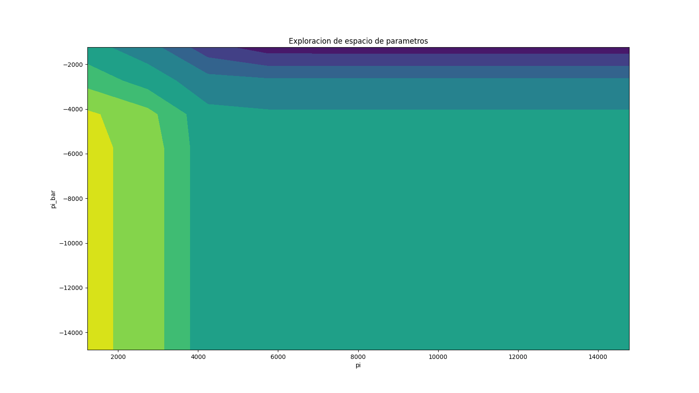

# Generación de Datos Sintéticos para Backtesting de Estrategias de Inversión

## Introducción

- **Objetivo:** Generar datos sintéticos para backtesting de estrategias de inversión.
- **Método:** Utilizar precios históricos y parámetros estimados para simular caminos de precios futuros.
- **Beneficio:** Permite probar estrategias en diferentes escenarios y reducir el riesgo de sobreajuste.

---
## Proceso de Precios de Ornstein-Uhlenbeck

- **Objetivo:** Modelar la reversión a la media en los precios de los activos financieros.
- **Uso:** Comúnmente utilizado en finanzas para modelar la dinámica de tasas de interés, precios de commodities y otros activos financieros.

---
## Definición del Proceso de Ornstein-Uhlenbeck

- **Ecuación Diferencial Estocástica (SDE):**
  $$
  dX_t = \phi (\mu - X_t) dt + \sigma dW_t
  $$
  donde:
  - $X_t$ es el valor del proceso en el tiempo $t$.
  - $\phi$ es la velocidad de reversión a la media.
  - $\mu$ es el nivel de media al cual el proceso tiende a revertirse.
  - $\sigma$ es la volatilidad del proceso.
  - $W_t$ es un proceso de Wiener (movimiento browniano).
---

## Interpretación de los Parámetros

- **Velocidad de Reversión ($\phi$):** Determina la rapidez con la que el proceso vuelve a su media.
- **Media ($\mu$):** El nivel promedio al cual el proceso se revierte.
- **Volatilidad ($\sigma$):** Representa la magnitud de las fluctuaciones aleatorias en el proceso.
- **Proceso de Wiener ($W_t$):** Introduce la aleatoriedad en el modelo.

---

## Propiedades del Proceso

- **Media:**
  $$
  \mathbb{E}[X_t] = \mu + (X_0 - \mu) e^{-\phi t}
  $$
  - El proceso tiende hacia la media $\mu$ con una tasa de decaimiento exponencial.
  
- **Varianza:**
  $$
  \text{Var}(X_t) = \frac{\sigma^2}{2\phi} (1 - e^{-2\phi t})
  $$
  - La varianza aumenta inicialmente y se estabiliza en $\frac{\sigma^2}{2\phi}$.


---

## Paso 1: Estimación de Parámetros

### Fórmulas

- **Modelo de Reversión a la Media:**
  $$
  P_{i,t} = E_0[P_{i,T_i}] + \phi (P_{i,t-1} - E_0[P_{i,T_i}]) + \xi_t
  $$

- **Estimación de $\phi$:**
  $$
  \phi = \frac{\text{cov}(Y, X)}{\text{cov}(X, X)}
  $$

- **Estimación de $\sigma$:**
  $$
  \sigma = \sqrt{\text{var}(\xi_t)}
  $$
---
### Implementación

```python
def estimate_parameters(prices, E0):
    T_max = len(prices)
    X = []
    Y = []
    
    for t in range(T_max - 1):
        X.append(prices[t] - E0)
        Y.append(prices[t + 1])
    
    X = np.array(X).reshape(-1, 1)
    Y = np.array(Y).reshape(-1, 1)
    
    model = LinearRegression().fit(X, Y)
    phi_hat = model.coef_[0][0]
    
    Z = np.full((T_max - 1, 1), E0)
    residuals = Y - Z - phi_hat * X
    sigma_hat = np.sqrt(np.var(residuals))
    
    return sigma_hat, phi_hat
```

---

## Paso 2: Construcción de la Matriz de Umbrales
---
### Fórmulas

- **Pares de Stop-Loss y Toma de Ganancias:**
  $$
  \pi = \{-12\sigma, -\sigma, \ldots, -\sigma\}
  $$
  $$
  \bar{\pi} = \{\sigma, \ldots, 12\sigma\}
  $$

### Implementación

```python
def construct_mesh(sigma):
    pi = np.linspace(-12 * sigma, -sigma, 10)
    pi_bar = np.linspace(sigma, 12 * sigma, 10)
    mesh = np.array(np.meshgrid(pi, pi_bar)).T.reshape(-1, 2)
    return mesh
```

---

## Paso 3: Generación de Caminos de Precios
---
### Fórmulas

- **Simulación de Caminos:**
  $$
  P_{i,t} = E_0 + \phi (P_{i,t-1} - E_0) + \mathcal{N}(0, \sigma)
  $$

### Implementación

```python
def generate_paths(N, T_max, sigma, phi, initial_price, E0):
    paths = np.zeros((N, T_max))
    paths[:, 0] = initial_price
    for i in range(N):
        for t in range(1, T_max):
            paths[i, t] = E0 + phi * (paths[i, t - 1] - E0) + np.random.normal(0, sigma)
    return paths
```

---

## Paso 4: Aplicación de la Lógica de Trading
---
### Lógica

- **Reglas de Stop-Loss y Toma de Ganancias:**
  - Salir si $\pi$ o $\bar{\pi}$ es alcanzado.
  - Salir si se alcanza el tiempo maximo de simulacion
  - Calcular el Sharpe Ratio para cada par de umbrales.

$$
\text{Sharpe Ratio} = \frac{\mathbb{E}[P_{i,T_i} - P_{i,0}]}{\sigma(P_{i,T_i} - P_{i,0})}
$$
---
### Implementación

```python
def apply_trading_logic(paths, mesh, T_max):
    N = paths.shape[0]
    results = []

    for pi, pi_bar in mesh:
        final_pnl = []
        
        for j in range(N):
            for t in range(T_max):
                pnl = paths[j, t] - paths[j, 0]
                if pnl <= pi or pnl >= pi_bar:
                    final_pnl.append(pnl)
                    break
                if t == T_max - 1:
                    final_pnl.append(pnl)
        
        sharpe_ratio = np.mean(final_pnl) / np.std(final_pnl)
        results.append([pi, pi_bar, sharpe_ratio])
    
    return pd.DataFrame(results, columns=['pi', 'pi_bar', 'sharpe_ratio'])
```

---

## Paso 5: Determinación de la Regla Óptima

### Implementación

```python
def determine_optimal_rule(results):
    return results.loc[results['sharpe_ratio'].idxmax()]
```
---
### Ejemplo de Uso

```python
# Define input data
E0 = prices.mean()

# Step 1: Estimate parameters
sigma_hat, phi_hat = estimate_parameters(prices.values, E0)

# Step 2: Construct mesh
mesh = construct_mesh(sigma_hat)

# Step 3: Generate paths
N = 100000
T_max = 100
initial_price = prices.iloc[0]
paths = generate_paths(N, T_max, sigma_hat, phi_hat, initial_price, E0)

# Step 4: Apply trading logic
results = apply_trading_logic(paths, mesh, T_max)

# Step 5: Determine optimal rule
optimal_rule = determine_optimal_rule(results)

print(optimal_rule)

# Plot the contour
sorted_results = results.sort_values(by=['pi', 'pi_bar'])
pivot_table = sorted_results.pivot_table('sharpe_ratio', 'pi', 'pi_bar')

plt.figure(figsize=(10, 8))
contour = plt.contourf(pivot_table.columns, pivot_table.index, pivot_table, cmap='viridis')
plt.title('Contour Plot of Sharpe Ratio')
plt.xlabel('pi')
plt.ylabel('pi_bar')
plt.show()
```
---
# Resultados
|        $\pi$ |   $\bar{\pi}$ |   sharpe_ratio |
|----------:|---------:|---------------:|
| **-14790.6**  | **13284.2**  |      **0.395471**  |
| -14790.6  | 10271.3  |      0.395304  |
| -14790.6  |  1232.55 |      0.236317  |
| -14790.6  |  2739    |      0.297171  |
| -14790.6  |  4245.45 |      0.339421  |
| -14790.6  |  5751.9  |      0.364218  |
| -14790.6  |  7258.35 |      0.379567  |

---
# Exploración del espacion R


---
# Testeo de estrategia en datos históricos
---

# Prueba de Estrategia de Inversión en Serie de Precios Real

- **Objetivo:** Probar una estrategia de inversión utilizando una serie temporal de precios real.
- **Método:** Aplicar reglas de stop-loss y toma de ganancias en datos históricos y calcular métricas de rendimiento.

---

## Descarga de Datos Históricos

```python
import yfinance as yf

# Descargar datos históricos de Bitcoin
btc_data = yf.download("BTC-USD", start="2020-01-01", end=pd.Timestamp.today().strftime('%Y-%m-%d'))
prices = btc_data['Close'].interpolate()
```

- **Uso de `yfinance`:** Descargar datos históricos de Bitcoin.
- **Interpolación de valores NA:** Rellenar valores faltantes en la serie de precios.

---

## Definición de la Lógica de la Estrategia

```python
def apply_strategy(prices, pi, pi_bar):
    initial_price = prices.iloc[0]
    pnl = 0
    for t in range(1, len(prices)):
        current_price = prices.iloc[t]
        pnl = current_price - initial_price
        
        if pnl <= pi or pnl >= pi_bar:
            break
    
    return pnl
```
---
- **Función `apply_strategy`:** Aplica las reglas de stop-loss y toma de ganancias en la serie de precios.
- **Parámetros:**
  - `pi`: Umbral de stop-loss.
  - `pi_bar`: Umbral de toma de ganancias.

---

## Prueba de la Estrategia en Datos Históricos

```python
def test_strategy(prices, pi, pi_bar):
    pnl_list = []
    for start in range(len(prices) - 1):
        pnl = apply_strategy(prices[start:], pi, pi_bar)
        pnl_list.append(pnl)
    
    sharpe_ratio = np.mean(pnl_list) / np.std(pnl_list)
    return pnl_list, sharpe_ratio
```
---

- **Función `test_strategy`:** Itera sobre la serie de precios y aplica la estrategia para calcular el PnL (Profit and Loss).
- **Cálculo del Sharpe Ratio:**
  $$
  \text{Sharpe Ratio} = \frac{\text{Promedio del PnL}}{\text{Desviación Estándar del PnL}}
  $$

---

## Ejecución de la Estrategia

```python
# Valores de ejemplo para pi y pi_bar
pi = -2000  # Stop-loss
pi_bar = 2000  # Toma de ganancias

# Probar la estrategia en datos históricos
pnl_list, sharpe_ratio = test_strategy(prices, pi, pi_bar)

# Imprimir resultados
print(f"Sharpe Ratio: {sharpe_ratio}")

# Graficar la distribución de PnL
import matplotlib.pyplot as plt

plt.figure(figsize=(10, 6))
plt.hist(pnl_list, bins=50, alpha=0.75)
plt.title('Distribución de PnL')
plt.xlabel('PnL')
plt.ylabel('Frecuencia')
plt.grid(True)
plt.show()
```


---
# Resultados
- **Sharpe Ratio:** 0.62
- **Retorno Promedio:** 50.78%
---
- **Distribución de PnL:**
  
---
# Simulación de Monte Carlo y Precio de Opciones de Black-Scholes
---

## Movimiento Browniano Geométrico (GBM)

- El modelo GBM es común en la simulación de precios de acciones en matemáticas financieras.
- Definido por la ecuación diferencial estocástica:

$$ dS_t = \mu S_t \, dt + \sigma S_t \, dW_t $$

- Donde:
  - $S_t$: Precio de la acción en el tiempo $t$.
  - $\mu$: Tasa de deriva (retorno promedio de la acción).
  - $\sigma$: Volatilidad de la acción.
  - $dW_t$: Proceso de Wiener (movimiento Browniano).


---

## Movimiento Browniano Geométrico (GBM)

- **Características:**
  - **No estacionario:** No retorna a una media.
  - **Deriva y volatilidad:** Proporcionales al precio actual.
  - **Distribución log-normal:** Los precios de las acciones tienden a ser positivos.
  - **Aplicación:** Modelado de precios de activos financieros.

---

## Proceso de Ornstein-Uhlenbeck (O-U) (Recordatorio)

- **Definición:**
  - Modelo para simular procesos revertidos a la media.
  - Descrito por la ecuación diferencial estocástica:

$$ dx_t = \phi (\mu - x_t) \, dt + \sigma \, dW_t $$

- **Características:**
  - **Estacionario:** Retorna a una media a largo plazo.
  - **Tasa de reversión:** $\phi$ controla la velocidad de retorno a $\mu$.
  - **Aplicación:** Modelado de tasas de interés, volatilidad, y otros fenómenos que revierten a la media.

---

## Comparación de Características

| Característica            | GBM                                  | O-U                                      |
|---------------------------|--------------------------------------|------------------------------------------|
| **Ecuación**              |  $dS_t = \mu S_t \, dt + \sigma S_t \, dW_t$ | $dx_t = \phi (\mu - x_t) \, dt + \sigma \, dW_t$ |
| **Media a largo plazo**   | No                                   | Sí                                       |
| **Volatilidad**           | Proporcional al precio actual        | Constante                                |
| **Estacionariedad**       | No                                   | Sí                                       |
| **Aplicación común**      | Precios de acciones                  | Tasas de interés, volatilidad             |

---

## Resumen

- **GBM**:
  - Modela crecimiento exponencial y fluctuaciones.
  - Adecuado para activos financieros que no tienen tendencia a regresar a una media específica.
- **O-U**:
  - Modela reversión a la media.
  - Adecuado para fenómenos donde hay una tendencia natural a retornar a un nivel promedio.


---

## Discretización del GBM

1. **Aproximación del cambio en el precio de la acción:**

$$\frac{dS_t}{S_t} \approx \mu \, dt + \sigma \, dW_t$$

2. **Cambio porcentual en $S_t$:**

$$S_{t+dt} = S_t \exp \left( (\mu - 0.5 \sigma^2) \, dt + \sigma \, \sqrt{dt} \, Z_t \right)$$

3. **Distribución log-normal:**
   - $Z_t$ es una variable normal estándar.
   - La exponeciación refleja que los precios bajo GBM son log-normales.

---

## Parámetros en la Simulación

- $r$ reemplaza a $\mu$ como tasa de deriva (tasa libre de riesgo).
- $(r - 0.5 \sigma^2)$ ajusta la deriva por la volatilidad.
- El factor $0.5 \sigma^2$ proviene de la corrección del Lema de Itô.

---

## Proceso de Simulación

1. **Inicialización de Parámetros:**
   - $S0$: Precio inicial
   - $K$: Precio de ejercicio
   - $T$: Tiempo hasta vencimiento
   - $r$: Tasa libre de riesgo
   - $\sigma$: Volatilidad
   - $M$: Pasos de tiempo
   - $N$: Trayectorias simuladas
---
2. **Bucle a través de los Pasos de Tiempo:**
   - Generar $N$ variables normales estándar $Z$.
   - Calcular el precio en el siguiente paso de tiempo:

$$S[:, i] = S[:, i-1] \times \exp \left( (r - 0.5 \sigma^2) \times dt + \sigma \times \sqrt{dt} \times Z \right)$$


---

## Establecer Parámetros

```python
S0 = 100      # Precio inicial de la acción
K = 105       # Precio de ejercicio
T = 1         # Tiempo hasta el vencimiento en años
r = 0.05      # Tasa de interés libre de riesgo
sigma = 0.2   # Volatilidad de la acción
M = 100       # Número de pasos de tiempo
N = 10000     # Número de trayectorias simuladas
```

- **S0:** Precio inicial de la acción.
- **K:** Precio de ejercicio.
- **T:** Tiempo hasta el vencimiento.
- **r:** Tasa de interés libre de riesgo.
- **sigma:** Volatilidad.
- **M:** Pasos de tiempo.
- **N:** Trayectorias simuladas.

---

## Simular Trayectorias de Precios de Acciones

```python
np.random.seed(123)
dt = T / M
S = np.zeros((N, M+1))
S[:, 0] = S0

for i in range(1, M+1):
    Z = np.random.randn(N)
    S[:, i] = S[:, i-1] * np.exp((r - 0.5 * sigma**2) * dt + sigma * np.sqrt(dt) * Z)
```

- **dt:** Incremento de tiempo.
- **S:** Matriz para almacenar precios simulados.
- **Z:** Variables aleatorias normales.

---

## Calcular Intervalos de Confianza del 95%

```python
S_mean = np.mean(S, axis=0)
S_ci_upper = np.quantile(S, 0.975, axis=0)
S_ci_lower = np.quantile(S, 0.025, axis=0)
```

- **S_mean:** Media de los precios simulados.
- **S_ci_upper:** Límite superior del IC del 95%.
- **S_ci_lower:** Límite inferior del IC del 95%.

---

## Precio de Opción mediante Monte Carlo

```python
payoffs = np.maximum(S[:, -1] - K, 0)
discounted_payoffs = np.exp(-r * T) * payoffs
mc_option_price = np.mean(discounted_payoffs)
```

- **payoffs:** Pago al vencimiento (Opcion Europea).
- **discounted_payoffs:** Pago descontado (al valor presente).
- **mc_option_price:** Precio de opción estimado por Monte Carlo.

---

## Precio de Opción de Black-Scholes

```python
d1 = (np.log(S0 / K) + (r + 0.5 * sigma**2) * T) / (sigma * np.sqrt(T))
d2 = d1 - sigma * np.sqrt(T)
bs_option_price = S0 * norm.cdf(d1) - K * np.exp(-r * T) * norm.cdf(d2)
```

- **d1, d2:** Variables de Black-Scholes.
- **bs_option_price:** Precio de opción de Black-Scholes.

---

## Imprimir Precios de Opción

```python
print(f"Monte Carlo Option Price: {mc_option_price:.2f}")
print(f"Black-Scholes Option Price: {bs_option_price:.2f}")
```

- Comparación de precios entre Monte Carlo y Black-Scholes.

---

## Graficar Trayectorias y Intervalos de Confianza

```python
plt.figure(figsize=(16, 9))
#plt.plot(S.T, color='gray', alpha=0.1)
plt.plot(S_ci_upper, color='red', linewidth=2, label='95% CI Upper')
plt.plot(S_ci_lower, color='red', linewidth=2, label='95% CI Lower')
```

- Gráfico de trayectorias y límites de intervalos de confianza.

---

## Sombrear Área entre la Trayectoria Más Alta y Más Baja

```python
S_max = np.max(S, axis=0)
S_min = np.min(S, axis=0)
plt.fill_between(range(M+1), S_max, S_min, color='gray', alpha=0.5, label='Min-Max Range')
```


---


---

## Resultados de la Simulación

- **Precio de opción mediante Monte Carlo:**
  - \( 7.99 \)
- **Precio de opción de Black-Scholes:**
  - \( 8.02 \)

---

## Conclusión

- Los precios de opciones calculados mediante Monte Carlo y Black-Scholes son muy cercanos (\$7.99 vs \$8.02), demostrando la eficacia de ambos métodos para valorar opciones.
- **GBM** es adecuado para modelar precios de acciones debido a su naturaleza no estacionaria y crecimiento exponencial.
- **O-U** es más apropiado para variables que tienden a revertir a una media, como las tasas de interés.

---

# Bibliografía
- López de Prado, M. (2018). *Advances in Financial Machine Learning*. Wiley. (Chapter 13)

